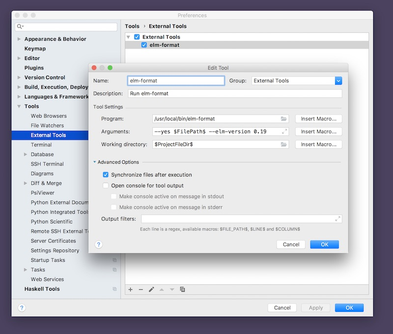
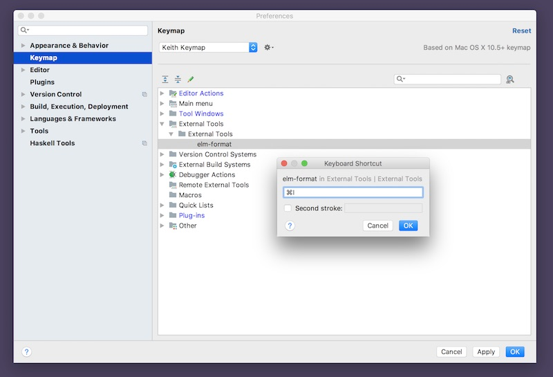
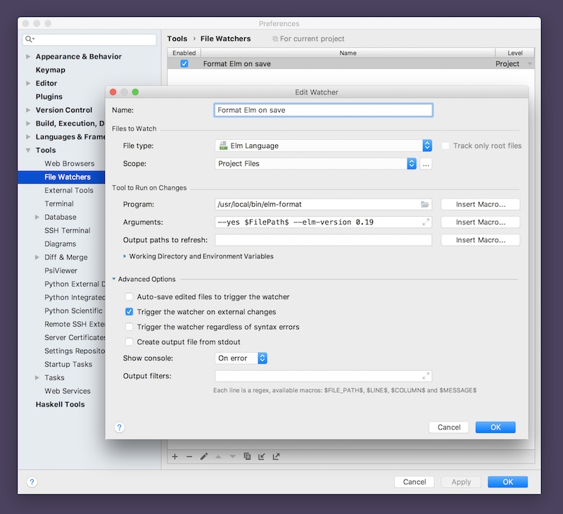

# Integrating elm-format

These instructions apply to IntelliJ IDEA, WebStorm, PhpStorm and PyCharm. Hereafter I will just use "IntelliJ" to refer to the product generically.

[elm-format](https://github.com/avh4/elm-format) is the standard way to format Elm source code. If you haven't already installed it, do it now. Then follow the instructions below:

- run elm-format [with a key-binding](#invoke-directly)
- run elm-format [automatically on save](#file-watcher)

## Invoke Directly

1. Open IntelliJ settings.
2. Select 'Tools' from the left-side pane
3. Select 'External Tools'
4. Click the '+' button near the bottom
5. Configure the tool using the settings in the screenshot (substituting the appropriate path to where you installed `elm-format`) 

> **IMPORTANT: WINDOWS USERS**
> When specifying the program path, make sure you use `elm-format.cmd` (with the `.cmd` suffix), _not_ the plain file named `elm-format`.

Finally, assign it to a key-binding so that it's easy to reformat your file.

1. Open IntelliJ settings
2. Select 'Keymap' from the left-side pane
3. Expand the 'External Tools' section until you find 'elm-format'
4. Double-click it and assign it a key-binding
5. See screenshot:

Now anywhere in an Elm file you can invoke `elm-format` on that file by pressing command-I (or whatever shortcut you choose).

## Optional File Watcher Integration

The instructions above configure `elm-format` to be run only when explicitly invoked by a keyboard shortcut. If you want to make elm-format totally automatic--so that it runs whenever an Elm file is saved--follow these instructions: 

1. Install the "File Watchers" plugin (installed by default in WebStorm, PhpStorm and PyCharm; available in the IntelliJ plugin repository for IntelliJ IDEA Ultimate; **not available** for Community Edition)
2. Add a file watcher for `.elm` files with the settings as shown here.

