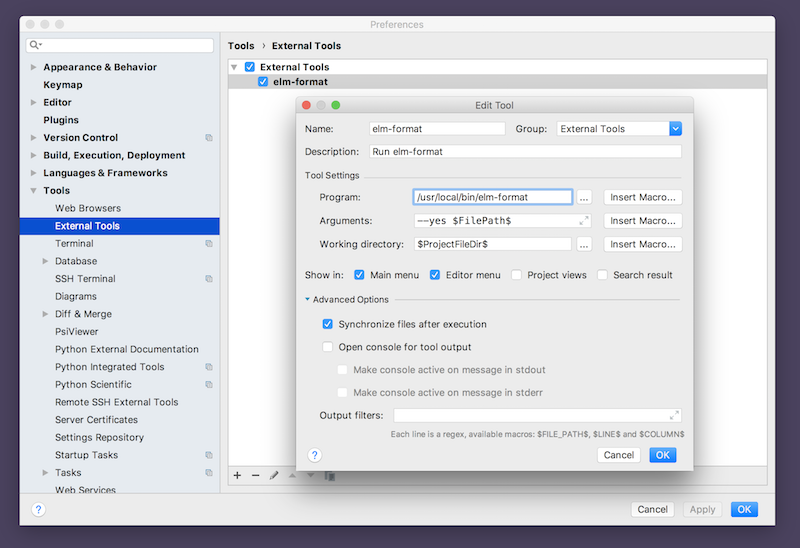
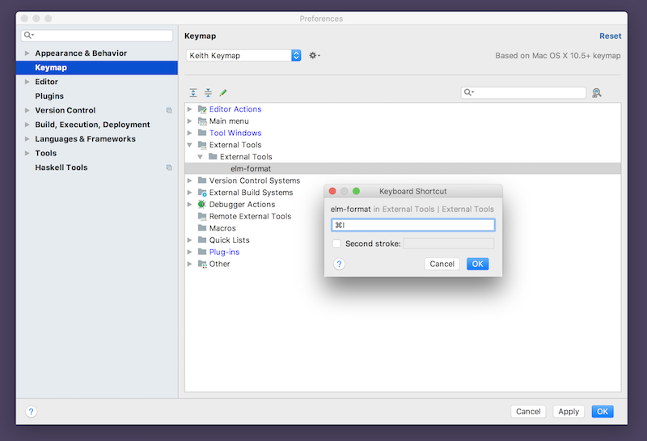
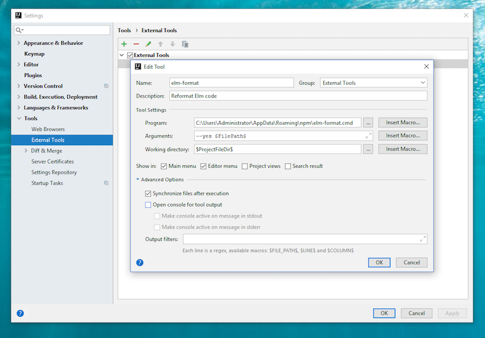
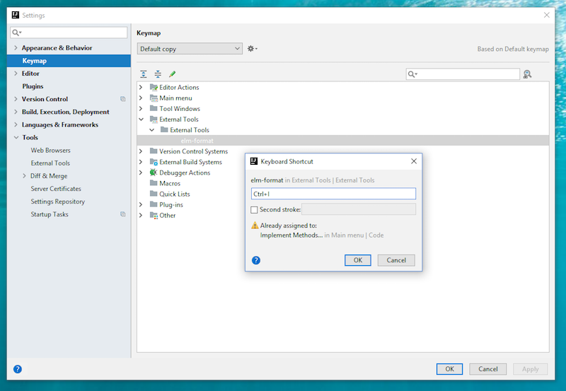

# Integrating elm-format

These instructions apply to IntelliJ IDEA, WebStorm, PhpStorm and PyCharm. Hereafter I will just use "IntelliJ" to refer to the product generically.

[elm-format](https://github.com/avh4/elm-format) is the standard way to format Elm source code.
Integrating it with IntelliJ is pretty easy.

- [macOS/Linux](#mac-linux) instructions
- [Windows](#windows) instructions

## Mac/Linux Setup

1. Open IntelliJ settings.
2. Select 'Tools' from the left-side pane
3. Select 'External Tools'
4. Click the '+' button near the bottom
5. Configure the tool using the settings in the screenshot (substituting the appropriate path to where you installed `elm-format`) 

Finally, assign it to a key-binding so that it's easy to reformat your file.

1. Open IntelliJ settings
2. Select 'Keymap' from the left-side pane
3. Expand the 'External Tools' section until you find 'elm-format'
4. Double-click it and assign it a key-binding
5. See screenshot:

Now anywhere in an Elm file you can invoke `elm-format` on that file by pressing command-I (as I configured it).

## Windows Setup

1. Open IntelliJ settings.
2. Select 'Tools' from the left-side pane
3. Select 'External Tools'
4. Click the '+' button near the bottom
5. Configure the tool using the settings in the screenshot (substituting the appropriate path to where you installed `elm-format`) 

**IMPORTANT**
When specifying the path to `elm-format`, **make sure** you use the `elm-format.cmd` (with the `.cmd` suffix), _not_ the plain file named `elm-format`.

Finally, assign it to a key-binding so that it's easy to reformat your file.

1. Open IntelliJ settings
2. Select 'Keymap' from the left-side pane
3. Expand the 'External Tools' section until you find 'elm-format'
4. Double-click it and assign it a key-binding
5. See screenshot:

Now anywhere in an Elm file you can invoke `elm-format` on that file by pressing ctrl-I (as I configured it).