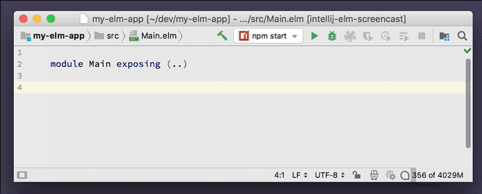

# Add Imports

Insert `import` statements at the top of your file without scrolling around.

Negligible performance impact. Although this feature depends on the "unresolved reference" inspection which performs a lot of computation in the background.

## Usage

While you write code, intellij-elm checks that the functions and types that your program uses can be resolved based on what's in scope. Errors are marked in red. If the error can be resolved by adding an import, intellij-elm will offer a quick fix action. Press **Option-Enter** _(macOS; Alt-Enter on Windows/Linux)_ and then select **Import** to generate the appropriate `import` and add it to the top of your file.

## Demo

