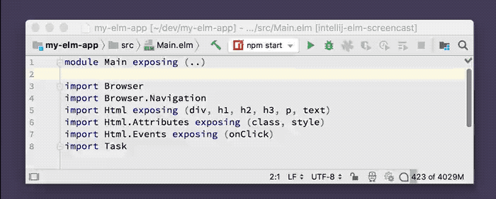

# Code Folding

Fold blocks of code (like the `import` section) to make more code visible

## Usage

By default, a module's `import`s are automatically collapsed using code folding. You can also collapse function and type declarations by pressing the `+` and `-` buttons in the editor gutter on the left-hand side.

## Demo

