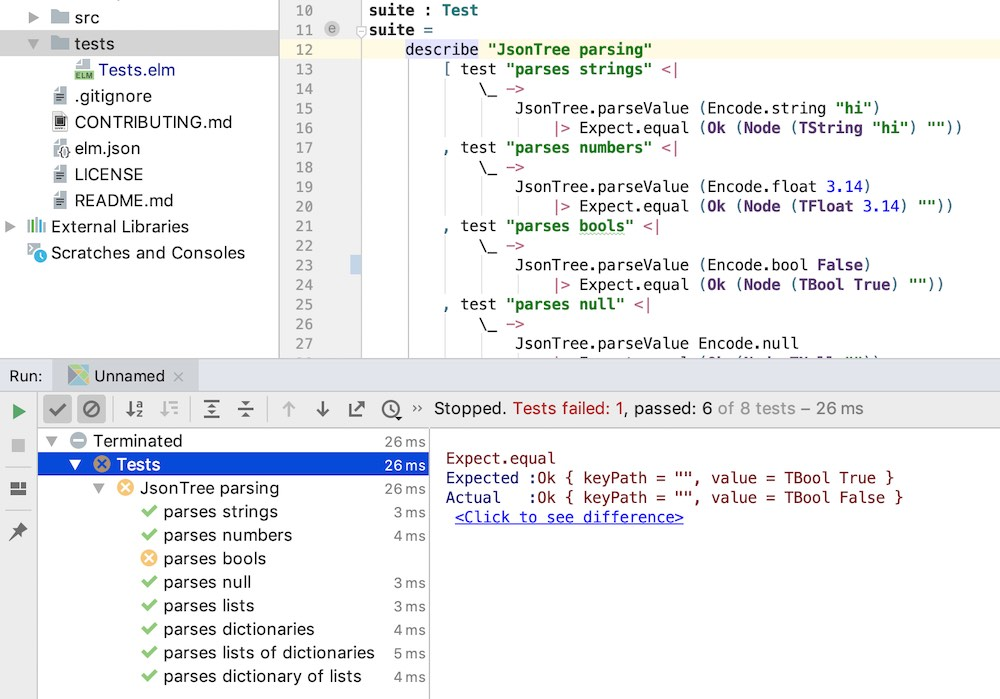

# elm-test

Run [elm-test](https://github.com/elm-explorations/test) from within IntelliJ.

This is useful if you want the convenience of running `elm-test` from a GUI with green and red lights for each test, indicating success and failure respectively.

Enabling this feature has no significant performance implications beyond the work that `elm-test` itself does to run your tests.


## Enable

1. Open **IntelliJ Settings**
2. Select **Languages & Frameworks** from the left-side pane
3. Select **Elm**
4. Fill out the section titled **elm-test** (use the **Auto Discover** button to search common locations) 


## Usage

Once you have configured the path to `elm-test` (see above), right-click anywhere within an Elm file and select **Run (Tests in $YourProjectName)**.


## Demo




## Custom Tests Location
By default, `elm-test` expects unit tests to exist in a folder called `tests` at the root of the Elm project, i.e. as a
sibling of `elm.json`. For _application_ projects (as opposed to _package_ projects) using _Elm 19_ (or later) a custom
location can be used, as discussed [here](https://github.com/rtfeldman/node-test-runner/pull/306#issuecomment-432835586).
In order for the Elm plugin to take advantage of this feature, the custom location must be specified as follows:

1. Create a file called `elm.intellij.json` as a sibling of `elm.json`.

1. Populate this file with the following content:
    ```
    {
      "test-directory": "..."
    }
    ```
   The value for `test-directory` should be the path to the folder containing the unit tests, relative to `elm.json`,
   e.g. `src/test/elm`.
   This folder can contain subfolders - all tests anywhere under this folder will be executed.

1. Update `elm.json` and add the value you used for `test-directory` above to the `source-directories` array.
1. Restart the IDE

As mentioned above, note that this only works for _applications_, not _packages_, i.e. only for projects where `elm.json`
has a `type` field with a value of `application`.
