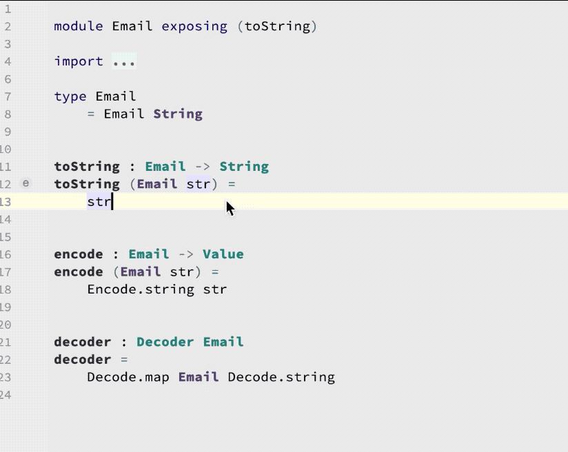

# Manage the Exposing List

Expose (or un-expose) a function or type without scrolling around.

## Usage

Put the cursor on the name of the function/type, press **Option-Enter** _(macOS; Alt-Enter on Windows/Linux)_, and then select **Add to exposing list** (or, if it's already exposed, **Remove from exposing list**).

A special icon will be displayed next to exposed functions/types in the gutter next to the line number. Click the icon to jump to where it's exposed.

## Demo

