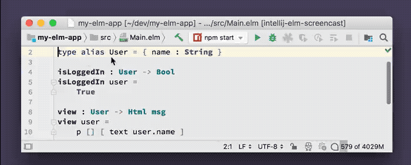

# Find Usages

Find all usages of a type, function, value, record field or module.

## Usage

Press **Option-F7** _(macOS; Ctrl-F7 on Windows/Linux)_ while the cursor is on an identifier to find all of its usages.

## Demo

