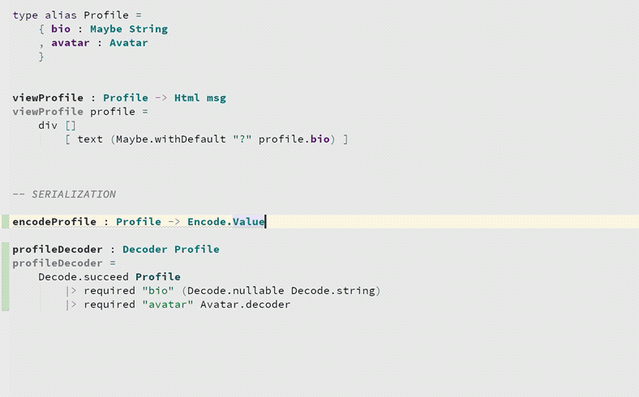

# Generate JSON Decoder/Encoder

Generate a JSON Decoder (or Encoder) based on a type annotation.
 

## Decoders

### Usage

1. Make sure that you have imported **`Json.Decode`**
2. **Put the cursor on a type annotation** where the return type is a **`Decoder`** from [elm/json](https://github.com/elm/json) (and the function body has **not yet been written**)
3. Press **Option-Enter** _(macOS; Alt-Enter on Windows/Linux)_
4. Select **Generate Decoder** from the menu

### Demo

 

## Encoders

### Usage

1. Make sure that you have imported **`Json.Encode`**
2. **Put the cursor on a type annotation** with a signature like `encodePerson : Person -> Json.Encode.Value` (and the function body has **not yet been written**)
3. Press **Option-Enter** _(macOS; Alt-Enter on Windows/Linux)_
4. Select **Generate Encoder** from the menu

### Demo

## Notes

* You can import `Json.Encode` and `Json.Decode` using **whatever alias you prefer**. The plugin will generate code using the same alias.
* When decoding/encoding a type which is not part of `elm/core`, the plugin will **search your project** for exposed functions which know how to encode/decode that type and, if found, will use that function.
* The generated decoders use **[Json.Decode.Pipeline](https://package.elm-lang.org/packages/NoRedInk/elm-json-decode-pipeline/latest/)** to decode records.