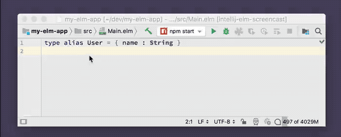

# Type-annotation-driven Development

Generate a function based on a type annotation.

This is useful for people who like to start with a type annotation before implementing a function. It will generate a function implementation with placeholders for the correct number of parameters.

## Usage

Put the cursor on a type annotation and press **Option-Enter** _(Alt-Enter on Windows/Linux)_ and select **Create** from the menu. A function declaration will be generated for you based on your type annotation. 

## Demo

