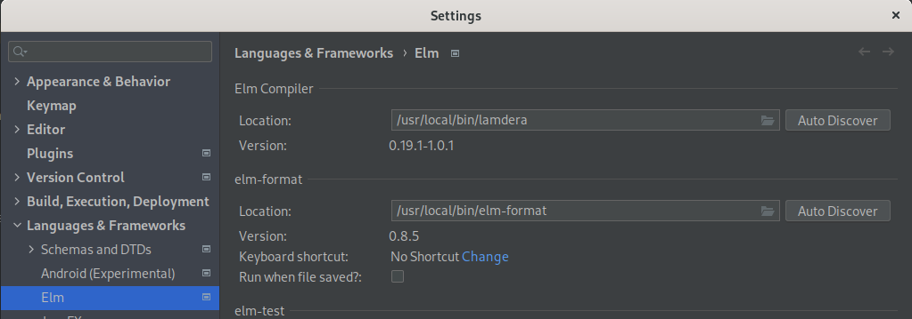

# Lamdera project support
This plugin supports Lamdera projects.
A lamdera project currently consists of:
- `elm.json` with a direct dependency to packages "lamdera/codecs" and "lamdera/core"
- `Frontend.elm` with a top-level definition named `app` defined by [frontend](https://dashboard.lamdera.app/docs/api) 
- `Backend.elm` with a top-level definition named `app` defined by [backend](https://dashboard.lamdera.app/docs/api)

To get going, you can download lamdera's compiler here:
[Download lamdera executable](https://dashboard.lamdera.app/docs/download)

## Tips for using `lamdera` executable as a compiler replacement for `elm`
To correctly set up the local package path for lamdera, you can do:

`ln -s ~/.elm/0.19.1 ~/.elm/0.19.1-1.0.1`

This plugin recognizes the lamdera executable as a replacement for the elm executable in the plugins's settings:

### Known quirks

On some Linux systems, the message "libtinfo.so.5: no version information available (required by lamdera)" apperas with every lamdera command.
There seems to be no easy solution, but until now, lamdera works as expected despite this message. This plugin will skip this message when analyzing lamdera's compiler output.
