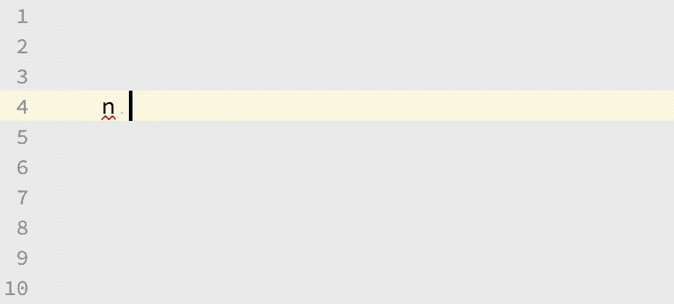

# Live Error Checking

Check for syntax errors, missing imports, type errors and other problems while you type.

Useful for anyone who wants a fast feedback loop when writing Elm code.

This feature operates in the background as you type, and it results in increased CPU and RAM usage. It's difficult to quantify as certain parts (the parser and the type inference algorithm) are used by other features of this plugin. This sort of feature is what makes an IDE so powerful, but it's also why they often feel more bloated than a text editor.

## Enable

This feature is enabled by default.

The syntax error checker cannot be disabled, but you can turn off the type checker and and unresolved reference checker. Disable them by going to **IntelliJ Settings -> Editor -> Inspections -> Elm** and un-checking each inspection that you want to disable.

## Demo

   