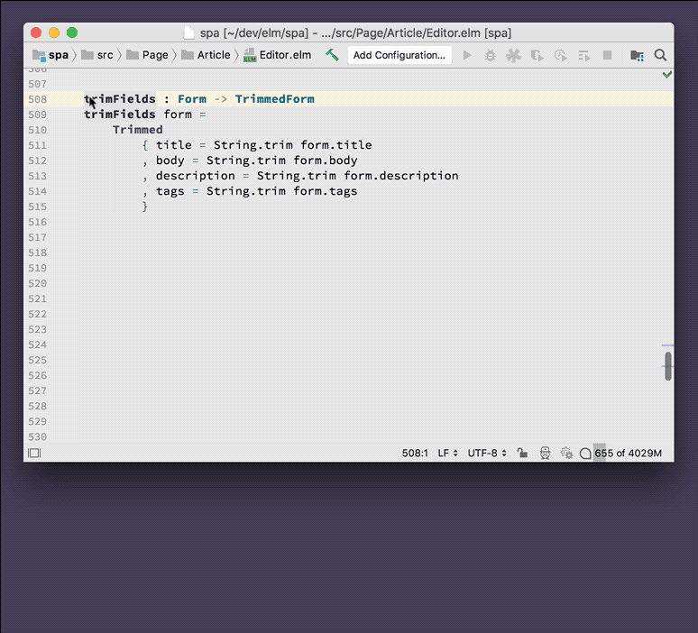

# Quick Docs

Show the documentation for a function, type, module.

Negligible performance impact. This runs only when invoked via keyboard shortcut.

## Usage

Press **Ctrl-J** (macOS) to display the documentation for a function, type, etc. It even works with doc comments within your own code. (Note: depending on your OS, the keyboard shortcut might be **Ctrl-Q** or **F1**)

## Demo
