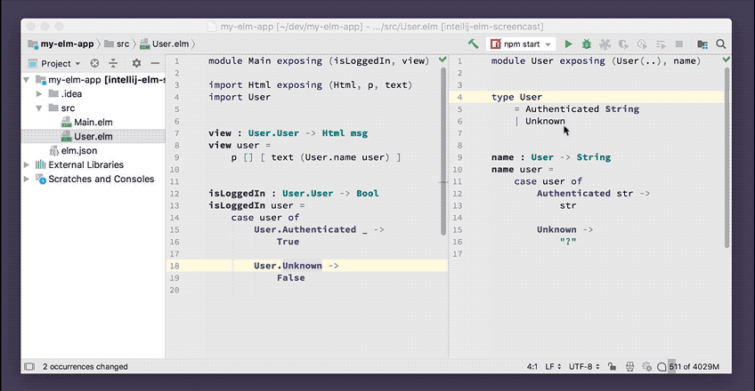

# Rename Refactoring

Reliably rename types, functions, values, record fields, modules and files. 

Negligible performance impact.

## Usage

Press **Shift-F6** to rename the identifier under the cursor. All references will also be renamed, including `import` statements and `exposing` lists.

## Demo

