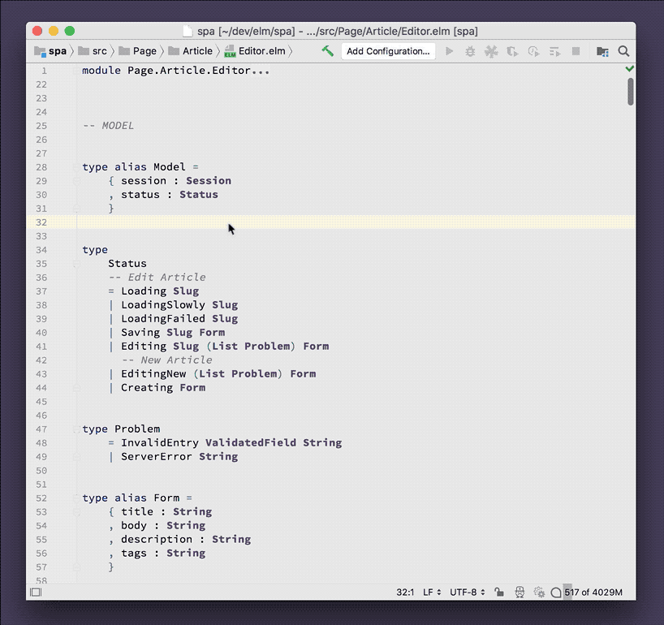
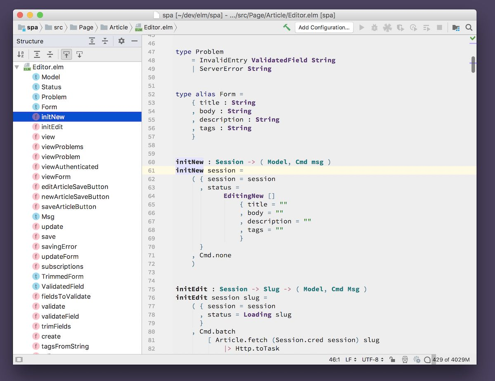

# Structure View

Get a 30,000 ft view of your Elm file's types, functions and values.

Negligible performance impact.

## Usage

When editing an Elm file, press **Cmd-F12** _(macOS; Ctrl-F12 on Windows/Linux)_ to popup the quick structure navigator. Use your keyboard to jump between functions and types effortlessly.

Open the structure view by clicking the **Structure** button on the left-edge of the IntelliJ window.

## Demo

Display the structure in a popup and use the keyboard to navigate:

Show the structure of your Elm file:

