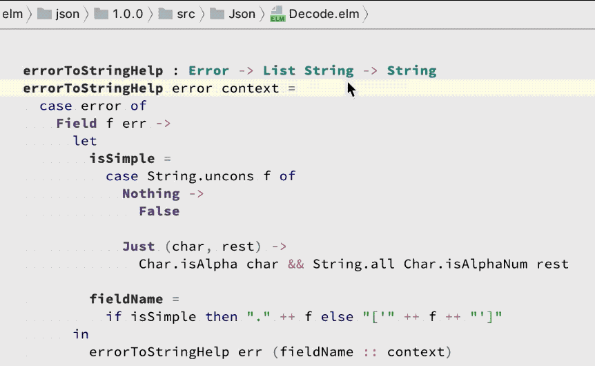

# Type Inference

Perform type inference on any expression in your program.

Sometimes you have a complex Elm expression and you want to know what the type of *part* of it is. With this feature you can select a sub-expression and ask IntelliJ to compute its type.

This feature operates automatically in the background, and increases RAM and CPU usage proportionally to the size of your codebase (and dependencies).  

## Usage

Press **Ctrl-Shift-P** to see the type of the expression under the cursor, or expand the selection to include parent expressions.

## Demo

