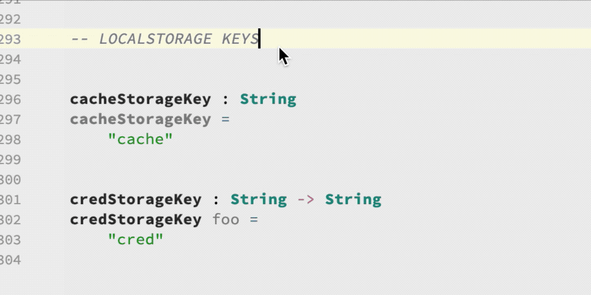

# Unused Code

Automatically detect unused functions, parameters, and types.

Moderate performance impact. For each identifier in your program, the plugin uses an index to find all files that may refer to that identifier. Then it parses each of those files to determine if it actually refers to (uses) that identifier.

## Usage

This feature runs automatically as you type. Unused code will be displayed in gray, indicating that it can safely be deleted.

## Demo

