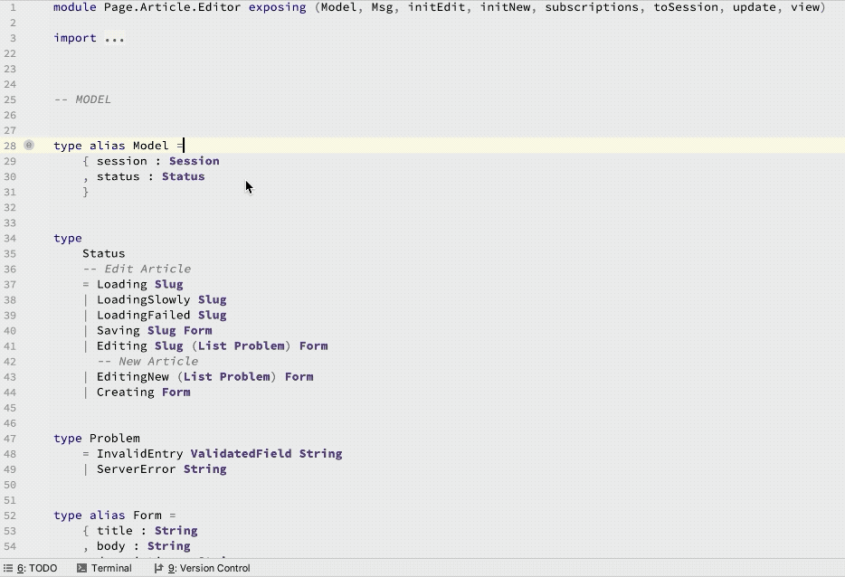

# Unused Imports

Detect & cleanup unused imports across your entire project

Elm code tends to accumulate imports over time, some of which may no longer be needed. Keep your code clean by getting rid of imports that are no longer necessary.

The performance impact of this feature by itself is negligible but it depends on core IDE functionality which does increase CPU and RAM usage in the background.

## Usage

The plugin automatically detects unused imports and shows them in gray. To remove an unused import, **put the cursor on it**, then press **Option-Enter** _(macOS; Alt-Enter on Windows/Linux)_, and then select **Optimize imports**.

### Project-wide Search
You can also search for unused imports across your entire Elm project. Open IntelliJ's "Search Anything" popup by pressing **Shift-Shift**. Then type **Run inspection by name**. Then type **Unused import** and pick the "Elm" one.

## Demo

